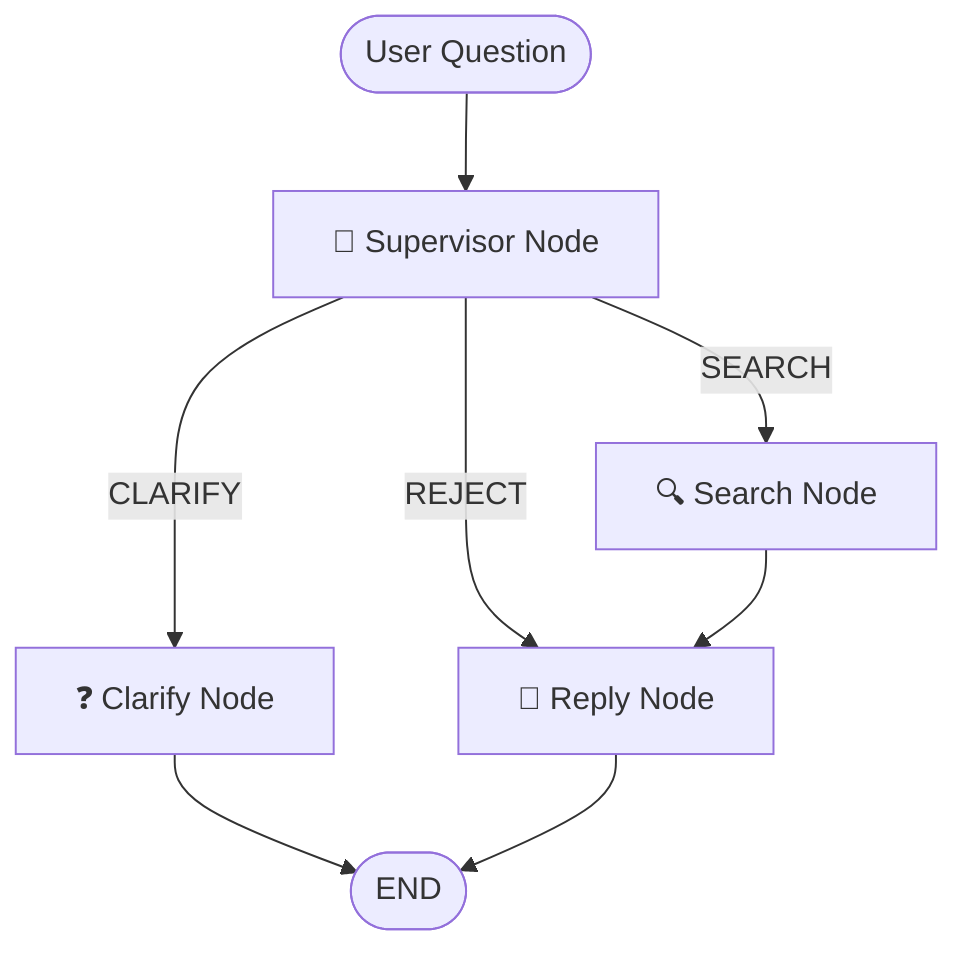

# 📈 Deep Financial Research Assistant
An AI-powered research agent built with LangGraph and Streamlit to analyze SEC filings for NVIDIA (NVDA) and Apple (AAPL). The agent uses a "Supervisor" pattern to decide whether to search the financial database, ask for clarification, or reject a non-financial query.

## 🌐 Live Demo

**The system is currently deployed live on Google Cloud Platform!** 

If you'd like access to the live demo, please connect with me on [LinkedIn](https://www.linkedin.com/in/jibril-frej/) and I'll provide you with the access details.

## 🚀 How to Install


### 1. Clone the repository:
```bash
git clone git@github.com:Jibril-Frej/deep-financial-research.git
cd deep-financial-research
```

### 2. Create and activate a virtual environment:
    
```bash
conda create -n dfr python=3.12
conda activate dfr
```

### 3. Install dependencies:
    
```bash
pip install -r requirements.txt
```


### 4. Set up environment variables:
    
Create a .env file in the root directory (see .env.example):

```
OPENAI_API_KEY=your_openai_key_here
EDGAR_IDENTITY=YourName your@email.com
DEEP_FINANCIAL_RESEARCH_PASSWORD=yourpassword
```

## ☁️ Cloud Deployment

The application is configured for deployment on Google Cloud Platform using:

- **Cloud Run**: Serverless container deployment
- **Cloud Build**: Automated CI/CD pipeline 
- **Secret Manager**: Secure API key management
- **Cloud Storage**: Data persistence for vector embeddings
- **Artifact Registry**: Container image storage

### Deployment Pipeline

The `cloudbuild.yaml` configuration automatically:
1. Downloads pre-built data from Cloud Storage
2. Builds the Docker image with caching
3. Pushes to Artifact Registry
4. Deploys to Cloud Run with proper secrets injection

To deploy your own instance:

```bash
# Ensure you have the required GCP services enabled
gcloud builds submit --config cloudbuild.yaml
```


## 📂 Data Preparation

### 1. Download Raw Files

Uses the edgar library to fetch the latest 10-K filings for Apple and Nvidia:

```
python scripts/ingest_sec.py
```

Raw files are stored in `data/raw`.

### 2. Build the Index

Run the indexing script to split the text into chunks and store them in the ChromaDB vector store:

```
python scripts/index.py
```

The vector database will be stored in `data/index`.

### 3. Visualize the Agent Graph (Optional)

Generate a diagram of the agent workflow:

```
python scripts/get_graph.py
```

This creates `graph_structure.png` showing the LangGraph flow.

## 🎯 How to Run

### Streamlit Web Interface (Recommended)

Launch the interactive web application:

```
streamlit run src/app.py
```

The app will be available at `http://localhost:8501` with a chat interface for asking questions about NVDA and AAPL financials.

### CLI Interface

For quick testing, run the console version:

```
python src/main.py
```

## 🏗️ Architecture 

### Agent Graph Structure

The application uses **LangGraph** to implement a supervisor pattern with conditional routing:




### Node Descriptions

- **🧠 Supervisor Node**: Analyzes incoming questions using GPT-4 to decide the appropriate action:
  - `SEARCH` - Question is about NVDA/AAPL financials
  - `CLARIFY` - Question is too vague or unclear
  - `REJECT` - Question is non-financial or about unsupported companies

- **🔍 Search Node**: Performs semantic search against ChromaDB vector store containing SEC filing chunks

- **❓ Clarify Node**: Prompts user for more specific information when questions are unclear

- **💬 Reply Node**: Generates final response using retrieved context from SEC filings

### State Management

The graph maintains state through a `GraphState` TypedDict containing:

```python
class GraphState(TypedDict):
    question: str                    # Original user query
    reformulated_question: Optional[str]  # Cleaned query for search
    search_results: List[str]        # Retrieved document chunks
    final_response: Optional[str]    # Generated answer
    next_step: str                   # Routing decision
```

## 📁 File Structure

### Core Application
```
src/
├── app.py                 # Streamlit web interface
├── main.py               # CLI interface for testing
└── graph/
    ├── blueprint.py      # LangGraph application definition and routing
    └── state.py         # Graph state management schema
```

### Agent Nodes
```
src/nodes/
├── supervisor.py         # Decision-making node with GPT-4
├── search.py            # ChromaDB vector search functionality
├── reply.py             # Response generation with context
└── clarify.py           # User clarification prompts
```

### Utilities & Configuration
```
src/
├── utils/
│   ├── config.py        # Pydantic settings with environment variables
│   └── logging.py       # Application logging configuration
└── tools/               # Future tool implementations
```

### Data Pipeline
```
scripts/
├── ingest_sec.py        # Download SEC filings via EDGAR API
├── index.py             # Text chunking and ChromaDB indexing
└── get_graph.py         # Generate agent workflow visualization

data/
├── raw/                 # Original SEC filing text files
│   ├── AAPL_business.txt
│   ├── AAPL_mnda.txt    # Management Discussion & Analysis
│   ├── AAPL_risks.txt
│   └── NVDA_*.txt       # Similar files for NVIDIA
└── index/               # ChromaDB vector store
    └── chroma.sqlite3   # Vector database
```

### Project Configuration
```
requirements.txt         # Python dependencies for production
.env                    # Environment variables (OPENAI_API_KEY, EDGAR_IDENTITY)
Dockerfile              # Container configuration
cloudbuild.yaml         # GCP Cloud Build pipeline
README.md              # This documentation
```

## 💡 Usage Examples

Ask specific financial questions about the supported companies:

**✅ Good Questions:**
- "What are NVDA's main business risks?"
- "How does Apple generate revenue?"
- "What regulatory challenges does NVIDIA face?"

**❌ Vague Questions:**
- "Tell me about stocks" → Will trigger clarification
- "What about Tesla?" → Will be rejected (unsupported company)

## 🔧 Technical Details

- **Vector Search**: OpenAI `text-embedding-3-large` embeddings with ChromaDB
- **LLM Models**: GPT-4 for supervisor decisions and response generation
- **Document Processing**: SEC filings chunked for optimal retrieval
- **Framework**: LangGraph for orchestration, Streamlit for UI
- **Deployment**: Docker containerization with GCP Cloud Run
- **CI/CD**: Google Cloud Build for automated deployments
- **Infrastructure**: Google Cloud Platform with Secret Manager and Cloud Storage

## 📝 Notes

- Currently supports only NVIDIA (NVDA) and Apple (AAPL) 10-K filings
- Requires OpenAI API key for embeddings and chat completions
- EDGAR API requires user identification for SEC filing downloads