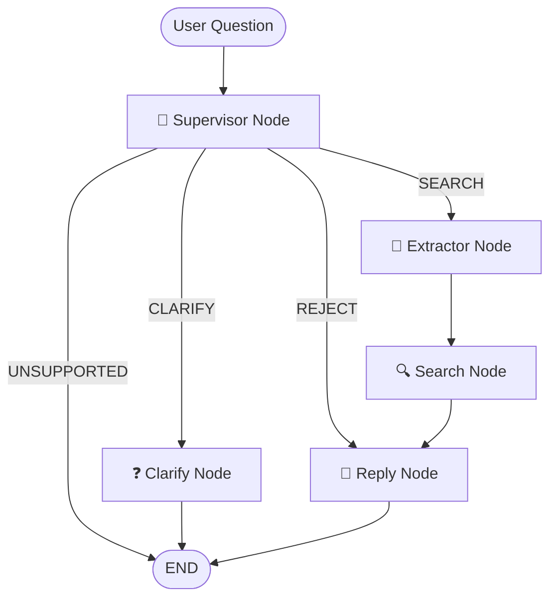

# 📈 Deep Financial Research Assistant
An AI-powered research agent built with LangGraph and Streamlit to analyze SEC 10-K filings for any S&P 500 company. The agent uses a multi-node supervisor pattern to route questions, extract company/section filters, search a vector database of SEC filings, and generate grounded responses.

## 🌐 Live Demo

**The system is currently deployed live on Google Cloud Platform!**

If you'd like access to the live demo, please connect with me on [LinkedIn](https://www.linkedin.com/in/jibril-frej/) and I'll provide you with the access details.

## 🚀 How to Install


### 1. Clone the repository:
```bash
git clone git@github.com:Jibril-Frej/deep-financial-research.git
cd deep-financial-research
```

### 2. Create and activate a virtual environment:

```bash
conda create -n dfr python=3.12
conda activate dfr
```

### 3. Install dependencies:

```bash
pip install -r requirements.txt
```


### 4. Set up environment variables:

Create a `.env` file in the root directory (see `.env.example`):

```
OPENAI_API_KEY=your_openai_key_here
EDGAR_IDENTITY=YourName your@email.com
DEEP_FINANCIAL_RESEARCH_PASSWORD=your_bcrypt_hash_here
```

Generate a bcrypt hash for your password:
```bash
python -c "import bcrypt; print(bcrypt.hashpw(b'yourpassword', bcrypt.gensalt()).decode())"
```

## ☁️ Cloud Deployment

The application is configured for deployment on Google Cloud Platform using:

- **Cloud Run**: Serverless container deployment (4 GiB memory, max 1 instance, 5 concurrent requests)
- **Cloud Build**: Automated CI/CD pipeline
- **Secret Manager**: Secure API key management
- **Cloud Storage**: Data persistence for vector embeddings and raw filings
- **Artifact Registry**: Container image storage

### Deployment Pipeline

The `cloudbuild.yaml` configuration automatically:
1. Downloads pre-built data (raw filings + vector index) from Cloud Storage
2. Builds the Docker image with layer caching
3. Pushes to Artifact Registry
4. Deploys to Cloud Run with secrets injection

```bash
gcloud builds submit --config cloudbuild.yaml
```


## 📂 Data Preparation

### 1. Download Raw Files

Fetches the latest 10-K filings (business, risk factors, MD&A sections) for all S&P 500 companies from EDGAR. Skips already-downloaded tickers so interrupted runs can be safely resumed.

```bash
python scripts/ingest_sec.py
```

Raw files are stored in `data/raw/` as `{TICKER}_{section}.txt` and `{TICKER}_metadata.json`.

### 2. Build the Index

Splits the raw text into chunks and indexes them into ChromaDB with metadata (ticker, section, GICS sector, filing URLs):

```bash
python scripts/index.py
```

The vector database (~2.1 GB) is stored in `data/index/`. Progress is displayed per batch.

**Note:** After re-running ingest with a different embedding model, delete `data/index/` before re-indexing to avoid dimension mismatch errors.


## 🎯 How to Run

### Streamlit Web Interface (Recommended)

```bash
streamlit run src/app.py
```

The app will be available at `http://localhost:8501`.

### CLI Interface

```bash
python src/main.py
```

## 🏗️ Architecture

### Agent Graph Structure

The application uses **LangGraph** to implement a multi-node supervisor pattern:


```mermaid
graph TD
    START([User Question]) --> supervisor["🧠 Supervisor Node"]
    supervisor --> |SEARCH| extractor["🏢 Extractor Node"]
    supervisor --> |CLARIFY| clarify["❓ Clarify Node"]
    supervisor --> |REJECT| reply["💬 Reply Node"]
    supervisor --> |UNSUPPORTED| END
    extractor --> search["🔍 Search Node"]
    search --> reply
    clarify --> END([END])
    reply --> END
```

### Node Descriptions

- **🧠 Supervisor Node**: Routes the question to the appropriate path:
  - `SEARCH` — question targets one specific S&P 500 company
  - `CLARIFY` — question is too vague (no company mentioned)
  - `REJECT` — question is unrelated to finance or SEC filings
  - `UNSUPPORTED` — question targets multiple companies, a sector, or a non-S&P 500 entity; responds immediately with a fixed message

- **🏢 Extractor Node**: Extracts the company ticker (e.g. `AAPL`) and the most relevant filing section (`risks`, `business`, `mnda`, or `null`) from the question. These are used as Chroma metadata filters.

- **🔍 Search Node**: Performs filtered semantic search against the ChromaDB vector store. Filters by ticker and optionally by section.

- **❓ Clarify Node**: Prompts the user for more specific information when the question is too vague.

- **💬 Reply Node**: Generates the final response using retrieved SEC filing chunks as context, with inline links to the original filings.

### State Management

```python
class GraphState(TypedDict):
    question: str                         # Original user query
    reformulated_question: Optional[str]  # Cleaned query for search
    ticker: Optional[str]                 # Extracted ticker, e.g. "AAPL"
    section: Optional[str]                # Extracted section: "risks", "business", "mnda", or None
    search_results: List[DocumentChunk]   # Retrieved chunks with metadata
    final_response: Optional[str]         # Generated answer
    next_step: str                        # Routing decision
```

## 📁 File Structure

### Core Application
```
src/
├── app.py                 # Streamlit entry point
├── main.py                # CLI interface for testing
├── components/
│   ├── auth.py            # Password authentication (bcrypt)
│   ├── chat.py            # Chat UI and graph execution
│   └── header.py          # Page title and disclaimer
├── graph/
│   ├── blueprint.py       # LangGraph graph definition and routing
│   └── state.py           # GraphState schema
└── services/
    └── rate_limit.py      # Per-session rate limiting (1 msg/s, 10 msg/min)
```

### Agent Nodes
```
src/nodes/
├── supervisor.py          # Routing decision (SEARCH/CLARIFY/REJECT/UNSUPPORTED)
├── extractor.py           # Company ticker and section extraction
├── search.py              # Filtered ChromaDB vector search
├── reply.py               # Response generation with SEC filing context
└── clarify.py             # Clarification prompts
```

### Utilities & Configuration
```
src/utils/
├── config.py              # Pydantic settings (SecretStr for all secrets)
└── logging.py             # Application logging
```

### Data Pipeline
```
scripts/
├── ingest_sec.py          # Download S&P 500 10-K filings from EDGAR
└── index.py               # Chunk and index into ChromaDB with progress bar

data/
├── raw/                   # SEC filing text files + metadata JSON per ticker
└── index/                 # ChromaDB vector store (~2.1 GB)
```

### Project Configuration
```
requirements.txt           # Python dependencies
.env.example               # Environment variable template
Dockerfile                 # Container configuration
cloudbuild.yaml            # GCP Cloud Build pipeline
```

## 💡 Usage Examples

**✅ Supported questions (single S&P 500 company):**
- "What are NVIDIA's main business risks?"
- "How does Apple generate revenue?"
- "What does Microsoft say about AI in its MD&A?"

**⚠️ Triggers clarification (no company mentioned):**
- "What are the main risks?"
- "How do companies discuss competition?"

**🚫 Unsupported (multiple companies or non-S&P 500):**
- "Compare Apple and Microsoft" → multi-company not yet supported
- "What are Harvard University's risks?" → not an S&P 500 company

**❌ Rejected (non-financial):**
- "What is the weather today?"

## 🔧 Technical Details

- **Vector Search**: OpenAI `text-embedding-3-small` embeddings with ChromaDB, filtered by ticker and section
- **LLM Models**: GPT-4.1-nano for supervisor/extractor/reply, GPT-4.1-mini for clarification
- **Coverage**: Latest 10-K filings for S&P 500 companies (business, risk factors, MD&A sections)
- **Security**: bcrypt password hashing, Pydantic `SecretStr` for all secrets, `.env` excluded from git
- **Framework**: LangGraph for orchestration, Streamlit for UI
- **Deployment**: Docker on GCP Cloud Run with Secret Manager and Cloud Storage
